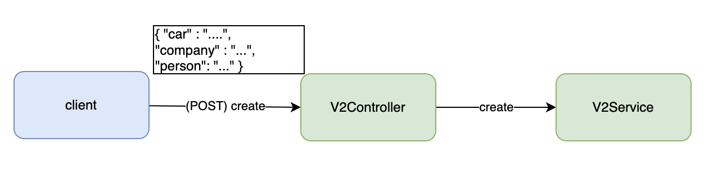

# Jackson을 이용한 추상화 서비스 맛보기 (+ JDK 17)
-- --
## 목표
### 3가지 방식의 API 구조 생성
> 1. (Featurer : 기능) (1:1) - (v1)
 
> 2. (Feature : 기능) (n:n) - (v2)
>- jdk17의 switch 기능을 이용하여 추상화 전 legacy 서비스를 구현한다.

>3. **(Feature : 기능) (n:n) - (v3)**
> - jackson의 @JsonTypeInfo, @JsonSubtypes 어노테이션을 이용해 추상화 된 presentation layer를 제공 한다. 
-- --
## 도메인
* Company
* Person
* Car
-- --
## API
* v1 api = (feature : 기능) - (1 : 1)
  .png)
* v2 api = (feature : 기능) - (n : n) ()
  
* v3 api = (feature : 기능) - (n : n) ()
  
-- --
## 기능
* 생성 (create)
> - 생성 기능의 행위를 전송해주는 임의의 전달 매체가 있다.

-- --
## 테스트

Presentation Layer 단위 테스트